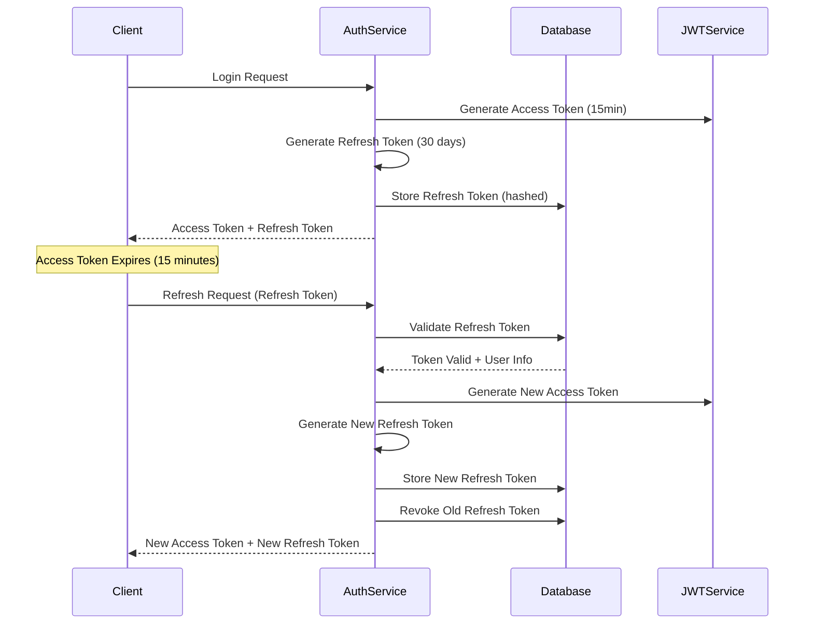

# YieldFabric Authentication System

## Introduction

The YieldFabric authentication system provides a comprehensive JWT-based authentication and authorization framework built in Rust. It supports multiple authentication methods including password-based login, signature-based authentication, and delegation tokens for secure access to system resources.

### Authentication Methods

The system supports multiple authentication methods:

- **Password-based Login**: Traditional email/password authentication
- **Signature-based Authentication**: Cryptographic signature authentication
- **API Key Authentication**: Service-to-service authentication
- **Delegation Tokens**: Act on behalf of groups or other users

## User Authentication

### Basic Login Flow

The standard user authentication flow involves logging in with email/password and receiving a JWT token for subsequent API calls.

#### 1. User Registration/Creation

```bash
# Create a new user (requires admin token)
curl -X POST "http://localhost:3000/auth/users" \
  -H "Content-Type: application/json" \
  -H "Authorization: Bearer <admin_token>" \
  -d '{
    "email": "user@example.com",
    "password": "secure_password",
    "role": "User"
  }'
```

**Response:**
```json
{
  "user": {
    "id": "user_uuid",
    "email": "user@example.com",
    "role": "User",
    "created_at": "2024-01-01T00:00:00Z"
  }
}
```

#### 2. User Login

```bash
# Login and get JWT token
curl -X POST "http://localhost:3000/auth/login/with-services" \
  -H "Content-Type: application/json" \
  -d '{
    "email": "user@example.com",
    "password": "secure_password",
    "services": ["vault", "payments"]
  }'
```

**Response:**
```json
{
  "token": "eyJhbGciOiJIUzI1NiIsInR5cCI6IkpXVCJ9...",
  "user": {
    "id": "user_uuid",
    "email": "user@example.com",
    "role": "User"
  }
}
```

#### 3. Using JWT Token for API Calls

```bash
# Example: Get user profile
curl -X GET "http://localhost:3000/auth/users/me" \
  -H "Authorization: Bearer <jwt_token>"
```

### Token Renewal System

The authentication system includes a comprehensive refresh token mechanism for seamless token renewal without requiring users to re-authenticate.

#### Token Pair Structure

When users log in, they receive a token pair:
- **Access Token**: Short-lived (15 minutes) for API calls
- **Refresh Token**: Long-lived (30 days) for token renewal

#### Refresh Token Flow



#### Token Renewal API

**Refresh Access Token**
```bash
POST /auth/refresh
Content-Type: application/json

{
  "refresh_token": "your_refresh_token_here"
}
```

**Response:**
```json
{
  "access_token": "eyJhbGciOiJIUzI1NiIsInR5cCI6IkpXVCJ9...",
  "refresh_token": "new_refresh_token_here",
  "token_type": "Bearer",
  "expires_in": 900
}
```

#### Session Management

**Logout from All Devices**
```bash
POST /auth/logout-all
Authorization: Bearer <access_token>
```

**Response:**
```json
{
  "message": "Logged out from all devices"
}
```

**Logout from Current Device**
```bash
POST /auth/logout
Content-Type: application/json

{
  "refresh_token": "your_refresh_token_here"
}
```

**Response:**
```json
{
  "message": "Logged out from current device"
}
```

#### Refresh Token Security Features

1. **Token Hashing**: Refresh tokens are hashed before database storage
2. **Token Rotation**: New refresh token issued on each renewal
3. **Automatic Revocation**: Old refresh token is revoked when new one is issued
4. **Expiration Management**: 30-day expiration for refresh tokens
5. **Device Tracking**: Tracks device info and IP addresses
6. **Automatic Cleanup**: Periodic cleanup of expired tokens


### JWT Token Structure

The JWT tokens contain comprehensive claims for authentication and authorization:

```json
{
  "sub": "user_uuid",
  "aud": ["vault", "payments"],
  "exp": 1640995200,
  "iat": 1640991600,
  "role": "User",
  "permissions": ["ApiRead", "ApiWrite", "CreateUser"],
  "entity_scope": ["entity_uuid_1", "entity_uuid_2"],
  "session_id": "session_uuid",
  "auth_method": "jwt",
  "entity_type": "user",
  "email": "user@example.com",
  "account_address": "0x1234...",
  "group_account_address": null,
  "acting_as": null,
  "delegation_scope": null,
  "delegation_token_id": null
}
```

**Claims Explanation:**
- `sub`: Subject (user ID)
- `aud`: Audience (services the token is valid for)
- `exp`: Expiration timestamp
- `iat`: Issued at timestamp
- `role`: User role (SuperAdmin, Admin, Manager, Operator, Viewer, ApiClient)
- `permissions`: Array of specific permissions granted to the user
- `entity_scope`: Array of entity IDs the user has access to
- `session_id`: Unique session identifier
- `auth_method`: Authentication method used ("jwt", "delegation", "signature")
- `entity_type`: Type of entity ("user" or "group")
- `email`: User's email address
- `account_address`: User's blockchain account address
- `group_account_address`: Group's blockchain account address (for delegation)
- `acting_as`: Group ID when acting on behalf of a group
- `delegation_scope`: Specific permissions for delegation
- `delegation_token_id`: Unique identifier for delegation token

### Supported User Roles

The system supports six distinct user roles with different permission levels:

- **SuperAdmin**: Full system access with all permissions
- **Admin**: Administrative access within scope, can manage users and groups
- **Manager**: Can manage group members and update entities
- **Operator**: Read-only access with limited operations
- **Viewer**: Read-only access to most resources
- **ApiClient**: Limited API access for service-to-service communication

### Permission System

The system implements a comprehensive role-based access control (RBAC) system with granular permissions:

#### User Management Permissions
- `CreateUser`: Create new users
- `ReadUser`: View user information
- `UpdateUser`: Modify user details
- `DeleteUser`: Remove users
- `UsersManage`: Comprehensive user management

#### Entity Management Permissions
- `CreateEntity`: Create new entities
- `ReadEntity`: View entity information
- `UpdateEntity`: Modify entity details
- `DeleteEntity`: Remove entities

#### System Management Permissions
- `SystemConfig`: Configure system settings
- `ViewLogs`: Access system logs
- `ManageRoles`: Manage user roles and permissions

#### API Access Permissions
- `ApiRead`: Read access to APIs
- `ApiWrite`: Write access to APIs
- `ApiAdmin`: Administrative API access


#### Delegation Management Permissions
- `CreateDelegationToken`: Create delegation tokens
- `ViewDelegationTokens`: View delegation tokens
- `RevokeDelegationToken`: Revoke delegation tokens

#### Cryptographic Operations
- `CryptoOperations`: Perform cryptographic operations

#### Bulk Operations
- `BulkOperations`: Perform bulk operations on multiple entities

### Account Management

The authentication system automatically manages blockchain accounts for users:

- **Automatic Deployment**: Accounts are created automatically when users are created
- **Account Address**: Each user gets a unique blockchain account address
- **Account Status**: You can check if an account is deployed and ready for use

### Signature-Based Authentication

The system supports cryptographic signature-based authentication as an alternative to password-based login:

#### Signature Authentication

Signature-based authentication allows users to authenticate using cryptographic signatures instead of passwords:

- **Key Registration**: Register your public key for authentication
- **Challenge-Response**: Sign a challenge message to authenticate
- **Token Issuance**: Receive JWT tokens upon successful verification

## Delegation Authentication

The delegation system allows users to act on behalf of groups through delegation tokens, enabling organizational workflows and shared account management.

### Delegation Token Creation

#### 1. Create Delegation JWT

```bash
# Create delegation token for group operations
curl -X POST "http://localhost:3000/auth/delegation/jwt" \
  -H "Content-Type: application/json" \
  -H "Authorization: Bearer <user_token>" \
  -d '{
    "group_id": "group_uuid",
    "delegation_scope": [
      "CryptoOperations",
      "ReadGroup",
      "UpdateGroup",
      "ManageGroupMembers"
    ],
    "expiry_seconds": 3600
  }'
```

**Response:**
```json
{
  "delegation_jwt": "eyJhbGciOiJIUzI1NiIsInR5cCI6IkpXVCJ9...",
  "expires_at": "2024-01-01T01:00:00Z"
}
```

#### 2. Delegation Token Structure

```json
{
  "sub": "user_uuid",
  "aud": ["yieldfabric"],
  "exp": 1640995200,
  "iat": 1640908800,
  "role": "User",
  "permissions": [],
  "entity_scope": ["entity_uuid_1", "entity_uuid_2"],
  "session_id": "session_uuid",
  "auth_method": "delegation",
  "entity_type": "user",
  "email": "user@example.com",
  "account_address": "0x1234...",
  "group_account_address": "0xabcd...",
  "acting_as": "group_uuid",
  "delegation_scope": [
    "CryptoOperations",
    "ReadGroup",
    "UpdateGroup",
    "ManageGroupMembers"
  ],
  "delegation_token_id": "delegation_token_uuid"
}
```

### Supported Delegation Scopes

- **CryptoOperations**: Perform cryptographic operations
- **ReadGroup**: Read group information and members
- **UpdateGroup**: Modify group settings
- **ManageGroupMembers**: Add/remove group members
- **CreateDelegationToken**: Create additional delegation tokens

## API Endpoints Reference

### Authentication Endpoints

| Method | Endpoint | Description | Auth Required |
|--------|----------|-------------|---------------|
| POST | `/auth/users` | Create user | Admin token |
| POST | `/auth/login/with-services` | User login | None |
| GET | `/auth/users/me` | Get user profile | User token |
| GET | `/auth/users/{id}/permissions` | Get user permissions | Admin token |
| POST | `/auth/users/{id}/permissions` | Grant permission | Admin token |

### Token Management Endpoints

| Method | Endpoint | Description | Auth Required |
|--------|----------|-------------|---------------|
| POST | `/auth/refresh` | Refresh access token | Refresh token |
| POST | `/auth/logout` | Logout from current device | Refresh token |
| POST | `/auth/logout-all` | Logout from all devices | Access token |

### Delegation Endpoints

| Method | Endpoint | Description | Auth Required |
|--------|----------|-------------|---------------|
| POST | `/auth/delegation/jwt` | Create delegation token | User token |


## Error Handling

### Common HTTP Status Codes

- **200**: Success
- **400**: Bad Request (invalid parameters)
- **401**: Unauthorized (invalid/missing token)
- **403**: Forbidden (insufficient permissions)
- **404**: Not Found
- **409**: Conflict (resource already exists)
- **500**: Internal Server Error

### Error Response Format

```json
{
  "error": "Error message",
  "details": "Additional error details",
  "code": "ERROR_CODE"
}
```

## Security Considerations

1. **Token Expiration**: JWT tokens have configurable expiration times
2. **Permission Scoping**: Delegation tokens are limited to specific scopes
3. **Group Isolation**: Users can only access groups they're members of
4. **Audit Logging**: All operations are logged for compliance
5. **Rate Limiting**: API endpoints have rate limiting to prevent abuse

## Development Setup

## API Reference

### Authentication Endpoints

#### User Management

**Create User**
```bash
POST /auth/users
Authorization: Bearer <admin_token>
Content-Type: application/json

{
  "email": "user@example.com",
  "password": "secure_password",
  "role": "User"
}
```

**Response:**
```json
{
  "user": {
    "id": "550e8400-e29b-41d4-a716-446655440000",
    "email": "user@example.com",
    "role": "User",
    "is_active": true,
    "account_address": "0x1234567890abcdef...",
    "created_at": "2024-01-01T00:00:00Z",
    "updated_at": "2024-01-01T00:00:00Z"
  }
}
```

**Login with Services**
```bash
POST /auth/login/with-services
Content-Type: application/json

{
  "email": "user@example.com",
  "password": "secure_password",
  "services": ["vault", "payments"]
}
```

**Response:**
```json
{
  "token": "eyJhbGciOiJIUzI1NiIsInR5cCI6IkpXVCJ9...",
  "user": {
    "id": "550e8400-e29b-41d4-a716-446655440000",
    "email": "user@example.com",
    "role": "User",
    "account_address": "0x1234567890abcdef..."
  }
}
```

**Get User Profile**
```bash
GET /auth/users/me
Authorization: Bearer <jwt_token>
```

**Response:**
```json
{
  "user": {
    "id": "550e8400-e29b-41d4-a716-446655440000",
    "email": "user@example.com",
    "role": "User",
    "is_active": true,
    "account_address": "0x1234567890abcdef...",
    "permissions": ["ApiRead", "ApiWrite"],
    "entity_scope": ["entity_uuid_1", "entity_uuid_2"],
    "created_at": "2024-01-01T00:00:00Z"
  }
}
```

#### Delegation Management

**Create Delegation Token**
```bash
POST /auth/delegation-tokens
Authorization: Bearer <jwt_token>
Content-Type: application/json

{
  "group_id": "550e8400-e29b-41d4-a716-446655440001",
  "delegation_scope": ["ApiRead", "ApiWrite"],
  "expiry_seconds": 3600
}
```

**Response:**
```json
{
  "delegation_token": "eyJhbGciOiJIUzI1NiIsInR5cCI6IkpXVCJ9...",
  "delegation_token_id": "550e8400-e29b-41d4-a716-446655440002",
  "expires_at": "2024-01-01T01:00:00Z"
}
```

#### Key Management

**Register Signature Key**
```bash
POST /auth/signature-keys
Authorization: Bearer <jwt_token>
Content-Type: application/json

{
  "public_key": "0x1234567890abcdef...",
  "key_name": "My Signing Key",
  "key_type": "secp256k1"
}
```

**Response:**
```json
{
  "key_id": "550e8400-e29b-41d4-a716-446655440003",
  "public_key": "0x1234567890abcdef...",
  "key_name": "My Signing Key",
  "key_type": "secp256k1",
  "is_active": true,
  "created_at": "2024-01-01T00:00:00Z"
}
```

**Signature Authentication**
```bash
POST /auth/signature-login
Content-Type: application/json

{
  "public_key": "0x1234567890abcdef...",
  "signature": "0xabcdef1234567890...",
  "message": "challenge_message"
}
```

#### Token Management

**Refresh Access Token**
```bash
POST /auth/refresh
Content-Type: application/json

{
  "refresh_token": "your_refresh_token_here"
}
```

**Response:**
```json
{
  "access_token": "eyJhbGciOiJIUzI1NiIsInR5cCI6IkpXVCJ9...",
  "refresh_token": "new_refresh_token_here",
  "token_type": "Bearer",
  "expires_in": 900
}
```

**Logout from Current Device**
```bash
POST /auth/logout
Content-Type: application/json

{
  "refresh_token": "your_refresh_token_here"
}
```

**Response:**
```json
{
  "message": "Logged out from current device"
}
```

**Logout from All Devices**
```bash
POST /auth/logout-all
Authorization: Bearer <access_token>
```

**Response:**
```json
{
  "message": "Logged out from all devices"
}
```

## Getting Started

### Prerequisites

- Auth service running on port 3000
- Valid user account (created by admin)

### Quick Start

1. **Get Admin Token** (if you have admin access):
   ```bash
   # Use the provided scripts to get admin token
   ./scripts/yieldfabric-auth.sh admin
   ```

2. **Create a User** (requires admin token):
   ```bash
   curl -X POST "http://localhost:3000/auth/users" \
     -H "Content-Type: application/json" \
     -H "Authorization: Bearer <admin_token>" \
     -d '{
       "email": "user@example.com",
       "password": "secure_password",
       "role": "User"
     }'
   ```

3. **Login and Get Tokens**:
   ```bash
   curl -X POST "http://localhost:3000/auth/login/with-services" \
     -H "Content-Type: application/json" \
     -d '{
       "email": "user@example.com",
       "password": "secure_password",
       "services": ["vault", "payments"]
     }'
   ```

4. **Use Tokens for API Calls**:
   ```bash
   curl -X GET "http://localhost:3000/auth/users/me" \
     -H "Authorization: Bearer <access_token>"
   ```

This authentication system provides a robust foundation for building secure applications with proper user management, group delegation, and permission controls.
